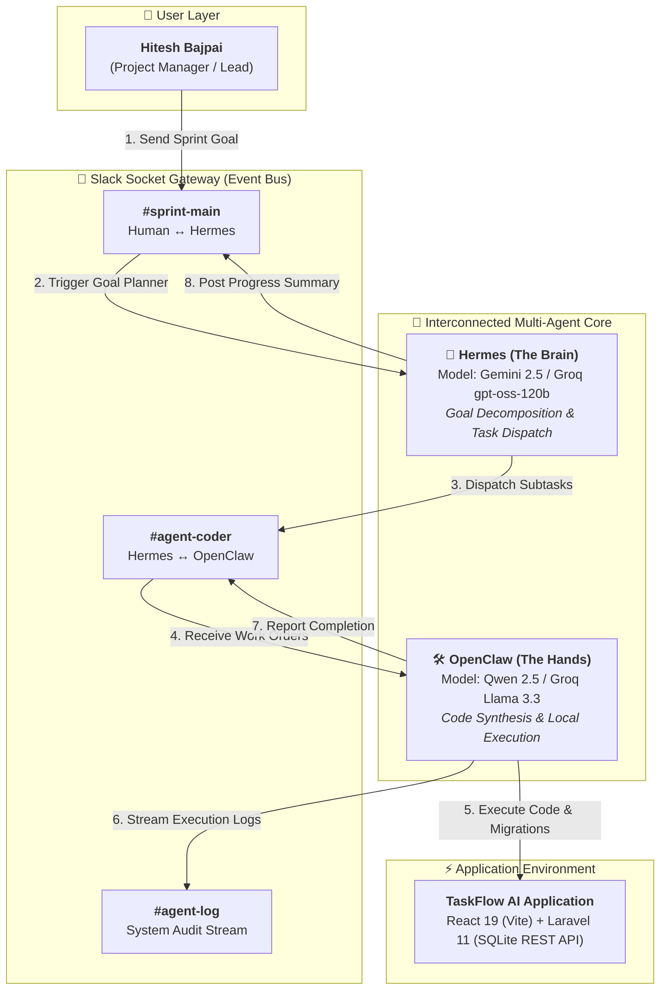

# System Architecture - TaskFlow AI Multi-Agent Engine

This document describes the 3-way interconnected multi-agent ecosystem (**Hermes [Brain] + OpenClaw [Hands] + Slack Socket Gateway**) engineered to develop, manage, and automate **TaskFlow AI**.

## 3-Way Agent Breakdown & Interconnection Scheme

### 1. Hermes (The Brain & Orchestrator)
*   **Role**: Orchestrator, Goal Planner, and Session Memory Keeper.
*   **Functionality**:
    *   Subscribes to `#sprint-main` Slack channel.
    *   Decomposes human prompts into structured subtasks with precise technical contracts.
    *   Dispatches tasks directly to OpenClaw via `#agent-coder`.
    *   Synthesizes execution updates and posts human-friendly progress reports back to `#sprint-main`.

### 2. OpenClaw (The Hands & Code Executor)
*   **Role**: Autonomous Code Executor and Environment Operator.
*   **Functionality**:
    *   Subscribes to `#agent-coder` for work orders from Hermes.
    *   Executes filesystem mutations, database migrations (`php artisan migrate`), frontend compilation (`npm run build`), and API route wiring.
    *   Streams structured execution traces and test outputs directly to `#agent-log` and reports status back to Hermes in `#agent-coder`.

### 3. Slack Gateway (Socket Mode Communications Hub)
*   **Role**: Real-Time Bidirectional Event Bus & Audit Trail.
*   **Channel Breakdown**:
    *   **`#sprint-main`**: Human $\leftrightarrow$ Hermes (High-level goal approvals and sprint status summaries).
    *   **`#agent-coder`**: Hermes $\leftrightarrow$ OpenClaw (Task delegation, JSON payloads, execution confirmation).
    *   **`#agent-log`**: System Event Stream (Raw command outputs, error tracebacks, cron jobs).

---

## Model Routing & Fallback Philosophy

We enforce the **"Strong Brain, Fast Hands"** routing model across our connected agents:

| Agent | Role / Task Type | Primary Model | Provider | Rationale |
|---|---|---|---|---|
| **Hermes** | Brain / Planning & Memory | `gemini-2.5-flash` / `openai/gpt-oss-120b` | Google Gemini / Groq | Low hallucination rate, broad reasoning capability, and high context capacity. |
| **OpenClaw** | Hands / Code Execution | `groq/llama-3.3-70b-versatile` / `qwen2.5-coder` | Groq / Ollama (Local) | Optimized for high-throughput code synthesis and zero-latency shell execution. |

### Fallback Ladder (Automatic Rate-Limit / 429 Recovery)
1. **Google Gemini** `gemini-2.5-flash` (Primary Planning & Reasoning)
2. **Groq Cloud** `openai/gpt-oss-120b` (Secondary Planning)
3. **Groq Cloud** `llama-3.3-70b-versatile` (Primary Execution)
4. **Ollama Local** `qwen2.5-coder` (Local execution fallback with unlimited tokens)

